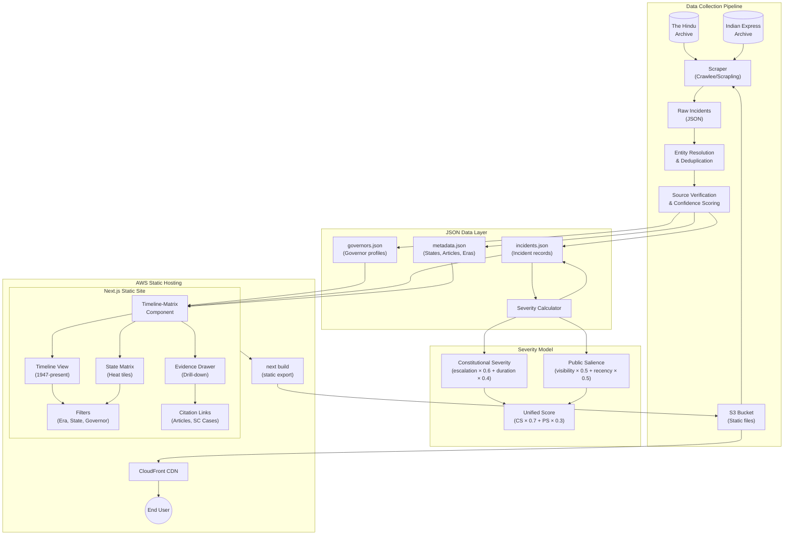

# Architecture: Goat Beard (Governors of India Evidence Platform)

## Intent

A static-first evidence platform that tracks gubernatorial transgressions with constitutional severity scoring. The architecture prioritizes:

1. **Offline-capable data pipeline** — Scraping runs independently, outputs JSON files
2. **Zero-runtime hosting** — Static Next.js export served via S3 + CloudFront
3. **Evidence-first UI** — Timeline-matrix with drill-down drawers, not modal takeovers

## System Diagram



**Rendered**: [ARCHITECTURE.svg](./ARCHITECTURE.svg)

## Data Flow

1. **Scrape** — Crawlee/Scrapling pulls articles from 3 news archives (2010–present)
2. **Deduplicate** — Entity resolution matches same incident across outlets
3. **Verify** — Confidence scoring based on source tier and corroboration count
4. **Score** — Dual-track severity calculation (Constitutional + Salience)
5. **Export** — JSON files committed to repo or build artifact
6. **Build** — Next.js static export reads JSON at build time
7. **Deploy** — S3 + CloudFront serves static assets globally

## Key Components

| Component | Technology | Responsibility |
|-----------|------------|----------------|
| Scraper | Crawlee (TS) or Scrapling (Python) | Archive crawling, anti-detection, proxy rotation |
| Deduplicator | Custom script | Entity resolution, claim ID assignment |
| Severity Calculator | TypeScript module | Dual-track scoring, escalation caps |
| Timeline-Matrix | React component | Heat-map tiles, era bands, clickable drill-down |
| Evidence Drawer | React component | Incident detail, citations, counter-narratives |
| Static Host | AWS S3 + CloudFront | CDN delivery, cache invalidation on deploy |

## JSON Schema (High-Level)

```
data/
├── governors.json      # Governor profiles with tenure, appointments, mobility
├── incidents.json      # Incident records with severity, sources, verification
├── metadata/
│   ├── states.json     # State/UT list with codes
│   ├── articles.json   # Constitutional articles referenced
│   └── eras.json       # Era definitions (Pre-Emergency, etc.)
```

## Review Notes

_JD: Add notes here after reviewing the architecture._
