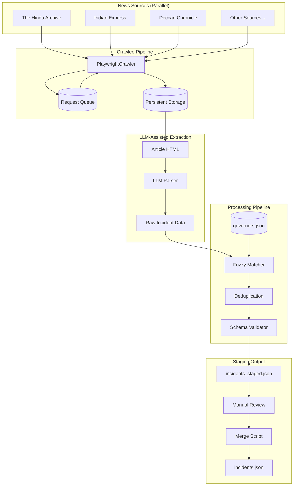

# Phase 2 Architecture: Data Aggregation Pipeline

## Intent

Build an automated pipeline that transforms news articles about gubernatorial transgressions into structured `Incident` records, using Crawlee for scraping and LLM-assisted extraction for data parsing.

## Architecture Diagram

**Rendered:** [ARCHITECTURE.svg](./ARCHITECTURE.svg)

## Component Responsibilities

### Crawlee Pipeline

| Component | Purpose | Key Files |
|-----------|---------|-----------|
| PlaywrightCrawler | Headless browser for JS-heavy archives | `scraper/crawler.ts` |
| Request Queue | BFS/DFS URL management, pause/resume | Crawlee built-in |
| Persistent Storage | Raw HTML/content cache | `./storage/` |

### LLM-Assisted Extraction

| Component | Purpose | Key Files |
|-----------|---------|-----------|
| Article Parser | Extract text, date, headline from HTML | `scraper/parser.ts` |
| LLM Extractor | Structured extraction of incident fields | `scraper/extractor.ts` |

**LLM prompting strategy:**
- Input: Article text + headline + date
- Output: JSON matching partial `Incident` schema
- Fields extracted: governor name, state, transgression type, bill name, dates, constitutional articles

### Processing Pipeline

| Component | Purpose | Key Files |
|-----------|---------|-----------|
| Fuzzy Matcher | Normalize governor names to IDs | `scraper/matcher.ts` |
| Deduplication | Identify same incident across sources | `scraper/dedup.ts` |
| Schema Validator | Ensure output matches `src/types/schema.ts` | `scraper/validator.ts` |

**Fuzzy matching approach:**
- Levenshtein distance on governor names
- Match against `data/governors.json` entries
- Threshold: 0.85 similarity for auto-match, below flags for review

**Deduplication logic:**
- Key: (governor_id, state, transgression_type, date_start ± 7 days)
- Merge strategy: Keep highest-credibility source, combine source arrays

### Staging Output

| Component | Purpose | Key Files |
|-----------|---------|-----------|
| incidents_staged.json | Review buffer before production | `data/incidents_staged.json` |
| Manual Review | Human verification step | CLI or UI tool |
| Merge Script | Append approved incidents | `scripts/merge-incidents.ts` |

## Data Flow

1. **Crawl**: PlaywrightCrawler fetches article pages from multiple sources in parallel
2. **Store**: Raw HTML saved to persistent storage (enables re-extraction without re-crawl)
3. **Extract**: LLM parses article text into structured incident fields
4. **Normalize**: Fuzzy matcher resolves governor names to canonical IDs
5. **Deduplicate**: Same incident from multiple sources merged
6. **Validate**: Schema validator ensures output matches `Incident` interface
7. **Stage**: Valid incidents written to `incidents_staged.json`
8. **Review**: Human reviews staged incidents for accuracy
9. **Merge**: Approved incidents merged into production `incidents.json`

## Integration Points

**Existing codebase touchpoints:**

| File | Integration |
|------|-------------|
| `src/types/schema.ts` | Scraper output must conform to `Incident` interface |
| `data/governors.json` | Fuzzy matcher reads for name resolution |
| `data/incidents.json` | Final merge target |
| `src/lib/data.ts` | Will load merged incidents at build time |

## Review Notes

*Space for JD edits and feedback*

---

*Architecture designed: 2026-03-12*
